# LARAVEL MULTIROLE APPLICATION
### Framework Programming Course
<p>Venia Sollery Aliyya Hasna - 5025201161</p>

---
 **What entities/models are involved in the application?**

The entities that are involved in this project are `User` and `Product`


Above is the models that are used in the code.

-----

**Application use cases. Format: *Role type* can perform *a feature***

As a use case, three roles are made which are `Admin`, `Seller`, and `Buyer`. These three role type have different feature.

The table below gives information about the features each roles have.

| Role Type   | feature  |
| ----------- | ----------- |
| Admin       | role-list, role-create, role-edit, role-delete, product-list, product-create, product-edit, product-delete |
| Seller      | role-list, product-list, product-create, product-edit, product-delete,       |
| Buyer       | product-list        |

Below is the list of users that are assigned to different roles.

 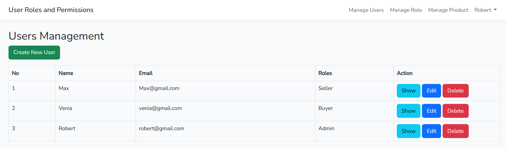

     ADMIN ROLE
     
 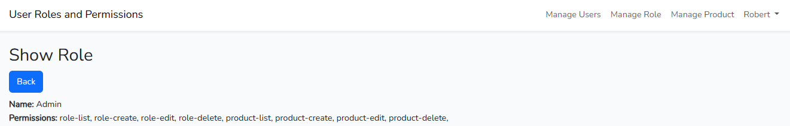
 
 As an example,the user is logged in as `Admin` since the role `Admin` can list, create, edit, and delete roles, of course it can access the role management page.
 
 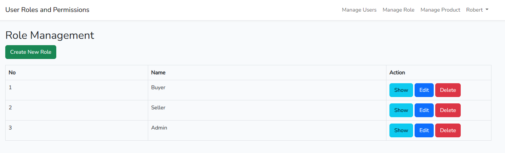
 
      SELLER ROLE
      
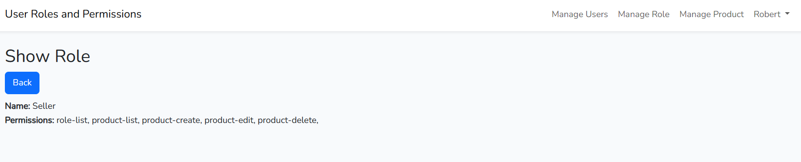  

Below is an interface when the role `Seller` tries to access role management page. the user is logged in as `Seller` since the role only have a feauture to list role the Show button will only be available.

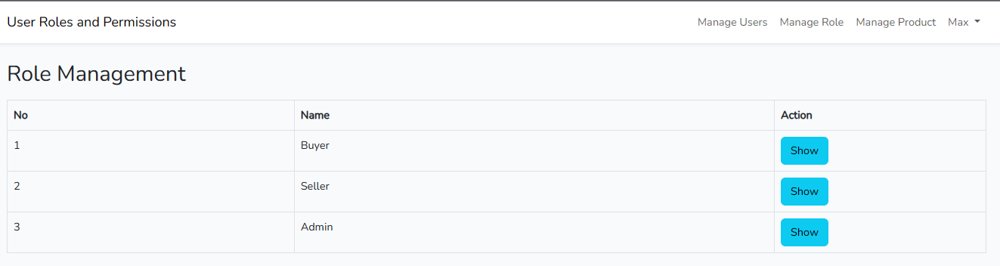 

     BUYER ROLE
     
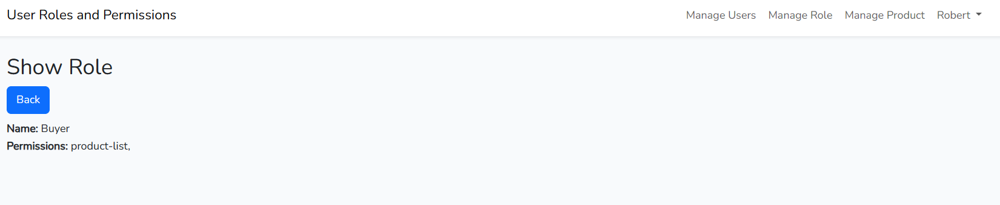

As an example the user is logged in as `Buyer`, that means it can only list products. Here is an example when `Buyer` tries to acces roles management page.

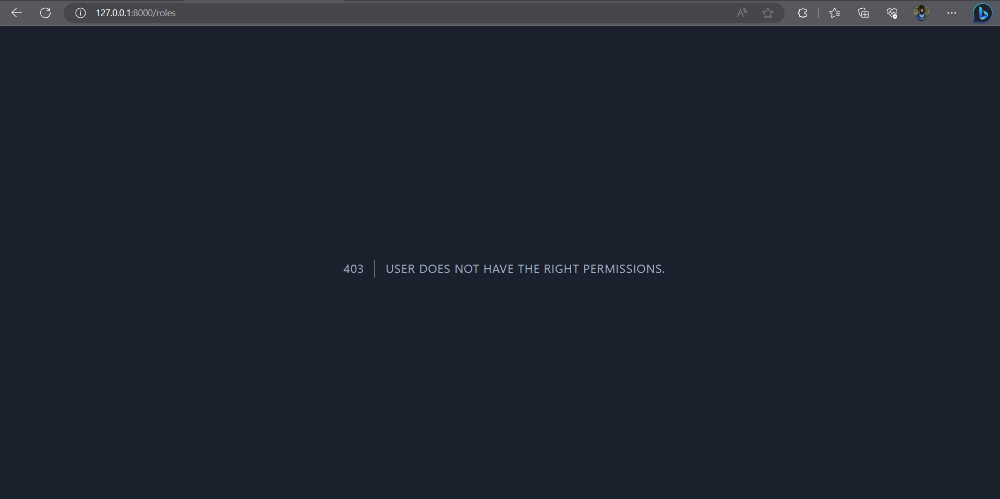

It will give a 403 status code.

But `Buyer` are able to list products. Below is an example:


     
-----

***Controllers, Middleware, and additional libraries used* and their respective functions**

There are 4 controllers in this project which are `HomeController`, `ProductController`, `RoleController`, and `UserController`. 

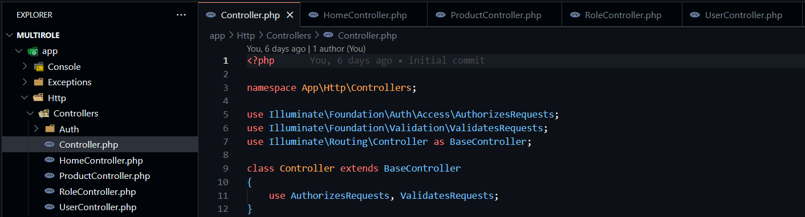

> HomeController

The functions of `HomeController` is to handle the request to the home page and also utilizez middleware so that only user that are logged in can access the page.

For example:

```php
public function __construct()
{
     $this->middleware('auth');
}
```
> ProductController

The functions of `ProductController` is to handle requests from clients and product-related actions. It also performs tasks such as data retrival and manipulation. In addition they construct response to client for Products.They also handle requests  such as create, edit, update, and delete products. Lastly, it contains middleware to which roles are able to access the page.

> RoleController

`RoleController` handles roles-related actions and is responsible for responding to client requests made to anything relating to Roles. It also carries out operations like data retrieval and manipulation. Additionally, they create client responses for roles.They also handle requests  such as create, edit, update, and delete roles. Finally, it has middleware that allows which roles has access for listing, editing, deleting, and creating roles.


> UserController

`UserController` handles user-related actions such as registration, login, and edit profile. It also handles user authentication and authorization.

**Middleware**

In this project it uses spite package for roles and permissions. It provides how to assign role to user and permissions to users and how to assign permission to roles. 
Spite package also comes with a built in middleware. The said middleware needs to be added to the `Kernel.php` file as below:

```php
 protected $middlewareAliases = [
     ...
     'role' => \Spatie\Permission\Middlewares\RoleMiddleware::class,
     'permission' => \Spatie\Permission\Middlewares\PermissionMiddleware::class,
     'role_or_permission' => \Spatie\Permission\Middlewares\RoleOrPermissionMiddleware::class,
     ...
 ];
```
This middleware functions as authorization for roles, permission, and both.


-----
**DB, external interfaces: database table structure used.**

**Database**

This project have several table such as `users` table, `roles` table, `products` table, `permissions` table, `roles_has_permissions` table, '`model_has_roles`table, and `model_has_permissions` table. 

> user table

The user table has 7 coulumns which consist of:

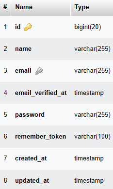

> roles table

The roles table has 5 coulumns which consist of:

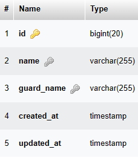

> products table

The product table has 5 coulumns which consist of:

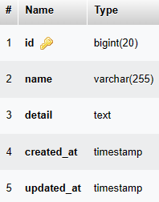

> permissions table

The permissions table has 5 coulumns which consist of:

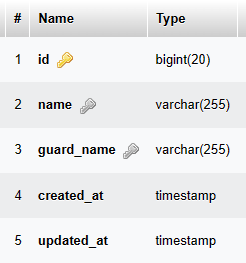

> roles_has_permissions table

The roles_has_permissions table has 2 coulumns which consist of:

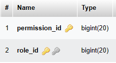

In this case the `role_id` is a foreign key from role_id in permissions table. 

> model_has_roles table

The model_has_roles table table has 3 coulumns which consist of:

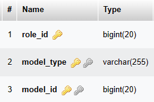

> model_has_permissions table

The model_has_permissions table table has 3 coulumns which consist of:

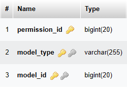

**External Interface**

> Data Access Interface 

-> This is the database that has been mentioned before.

> User Interfaces

-> This is the views which is located in the resources folder. This project consist of many different view including:

- Theme Layout which is the `app.blade.php`.

- User Module which are `index.blade.php`, `create.blade.php`, `edit.blade.php`, and `show.blade.php`

- Roles Module which are `index.blade.php`, `create.blade.php`, `edit.blade.php`, and `show.blade.php`

- Product Module which are `index.blade.php`, `create.blade.php`, `edit.blade.php`, and `show.blade.php`


